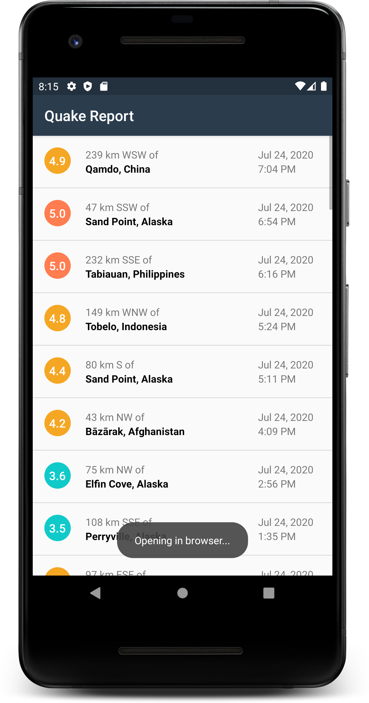
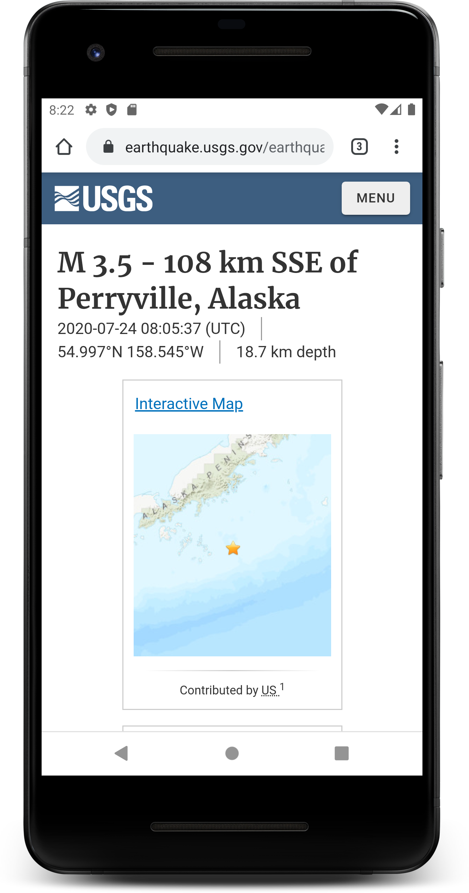

# QuakeReport

QuakeReport is an informative application which provides us data about the latest 50 earthquakes in the world having a magnitude of 3.5 and above. This application fetches the real time data from the USGS website. The application shows the magnitude, the location, the date and the time of each earthquake. Also this application provides more information about a particular earthquake by forwading the user to the USGS website whenever the user clicks on that particular earthquake view.

The minimum API Level of the app is 15 which means that only AVDs or Android Devices with API Level 15 or above or Android Version 4.0.3 or above will support the app.

## How to directly install the app in your android device?
* [app-debug.apk](https://github.com/jayesh-srivastava/QuakeReport-android/blob/master/apk%20file/app-debug.apk)
Click on the above link and click on 'view raw'. You might have to grant some initial permissions to install an app from an unknown source. Install and open.

### Developed by  [@jayesh-srivastava](https://github.com/jayesh-srivastava)

&ensp; &ensp; &ensp;
